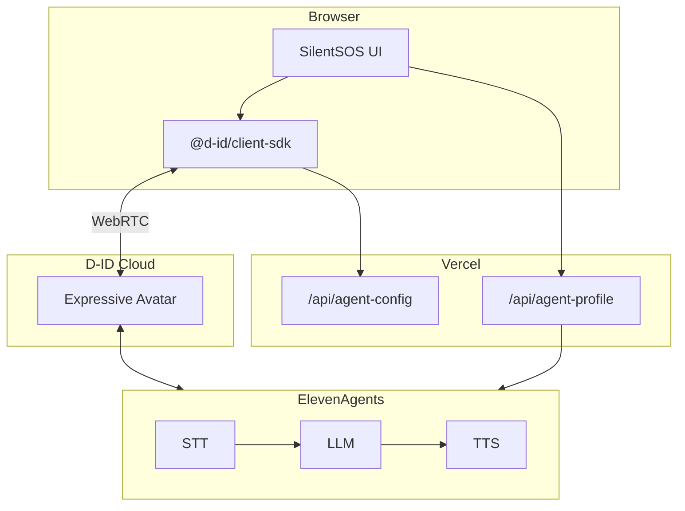

# SilentSOS — Architecture

Technical reference for the D-ID + ElevenAgents stack.

---

## System overview

SilentSOS is a **Next.js 16 app on Vercel** that connects a D-ID expressive avatar to an ElevenAgents conversational AI agent.

| Unit | Platform | Role |
|---|---|---|
| **Frontend + API** | Vercel | UI, D-ID SDK, profile sync |
| **Avatar session** | D-ID Cloud | WebRTC video, mic/camera, lip-sync |
| **Conversation brain** | ElevenAgents | STT → LLM → TTS |



---

## Session lifecycle

1. User fills **Emergency Profile**, optionally enables webcam
2. `POST /api/agent-profile` — sync profile into ElevenAgents prompt
3. `GET /api/agent-config` — fetch D-ID credentials
4. `createAgentManager()` → `connect()` → publish mic (and optional camera)
5. User speaks; avatar responds with lip-synced relay messages
6. Client parses messages into transcript + dispatch panels
7. `disconnect()` on end call

**Demo mode:** connects without mic, uses `agentManager.speak()` for scripted lines.

---

## API routes

| Route | Method | Purpose |
|---|---|---|
| `/api/agent-config` | GET | Returns `DID_AGENT_ID` + `DID_CLIENT_KEY` |
| `/api/agent-profile` | POST | Updates ElevenAgents system prompt with profile |
| `/api/reverse-geocode` | GET | Location helper for profile form |

---

## Environment variables

| Variable | Required | Purpose |
|---|---|---|
| `ELEVENLABS_API_KEY` | ✅ | Agent create/update (server-side) |
| `ELEVENLABS_AGENT_ID` | ✅ | ElevenAgents agent linked to D-ID |
| `DID_AGENT_ID` | ✅ | D-ID integrated agent |
| `DID_CLIENT_KEY` | ✅ | Domain-restricted frontend key |
| `DID_API_KEY` | setup only | Used by `create-did-agent` script |

---

## Key files

```
components/SilentSOSApp.tsx   Orchestration
components/CallScreen.tsx     Avatar video UI
lib/use-did-agent.ts          D-ID SDK hook
lib/agent-prompt.ts           Dual-mode relay instructions
lib/dispatch-script.ts        Dispatch triggers + demo script
scripts/create-elevenlabs-agent.mjs
scripts/create-did-agent.mjs
```

---

<p align="center"><a href="./README.md">← Back to README</a></p>
