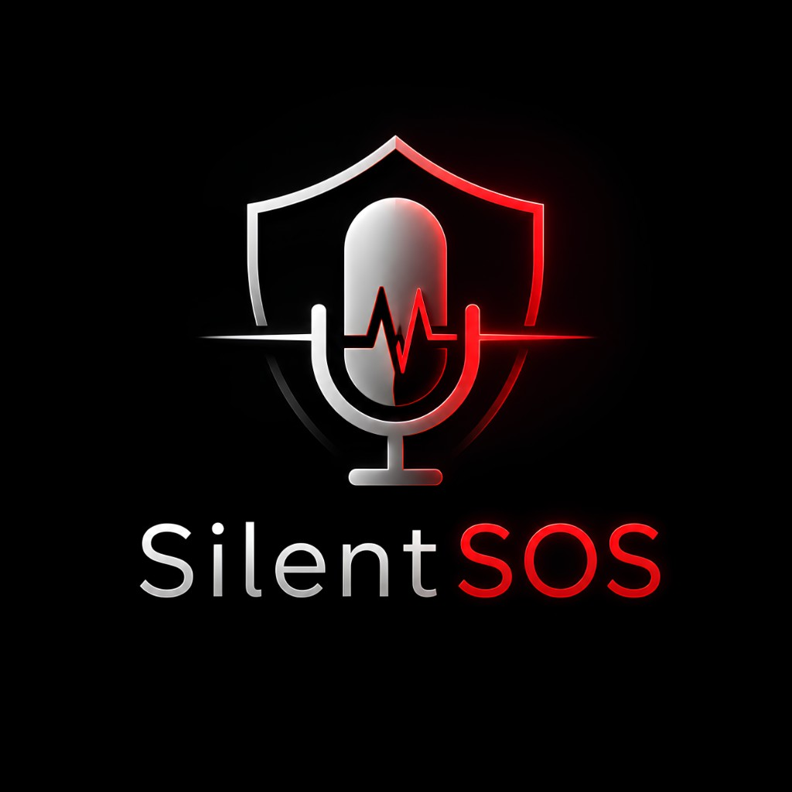

<p align="center">
  
</p>

<h1 align="center">SilentSOS</h1>

<p align="center">
  <strong>When you can't speak, AI speaks for you.</strong>
</p>

<p align="center">
  <a href="https://elevenlabs.io">ElevenHacks #10</a> ·
  <a href="https://elevenlabs.io/docs/agents-platform/customization/speech-engine">ElevenLabs Speech Engine</a> ·
  Voice AI Emergency Relay
</p>

<p align="center">
  
  
  
</p>

---

## The problem

In a real emergency, people often **cannot speak clearly** — panic, whispering, hiding, injury, or a threat in the room. Traditional voice systems fail when the caller goes silent. Help still needs context: *where they are, whether they're safe, what's happening*.

## The solution

**SilentSOS** is a voice AI relay that listens to distressed or whispered speech and **speaks on the user's behalf** to a simulated dispatch operator — powered by the **ElevenLabs Speech Engine** with a custom LLM backend.

The user stays calm. The AI asks short questions. When critical facts emerge, the agent relays them: *"Relaying to dispatch: Caller is hiding, location confirmed, not safe."*

> **SIMULATION ONLY** — Not connected to real 911 / 112 services. Built for ElevenHacks #10 demo and education.

---

## Why this wins on Speech Engine

| Capability | How SilentSOS uses it |
|---|---|
| **Custom Speech Engine server** | Own WebSocket server on Render runs the full agent brain via `onTranscript` |
| **Bring-your-own LLM** | Groq (`llama-3.3-70b`) streams responses back through `session.sendResponse()` |
| **Real-time voice** | WebRTC via `@elevenlabs/react` — live STT, TTS, interruption handling |
| **Profile injection** | Emergency profile synced to the engine before each call |
| **Dual-mode agent** | Mode A: talk to user · Mode B: relay critical facts to dispatch |

This is not a wrapper around a default agent — it is a **purpose-built emergency relay pipeline** on Speech Engine primitives.

---

## Live demo

| | URL |
|---|---|
| **Web app** | Deploy on Vercel → your `*.vercel.app` |
| **Speech Engine** | Render → `/health` returns `{ ok, speechEngineAttached, llmProvider }` |

**Try it:**
1. Fill in the **Emergency Profile** (name, location, threat type)
2. **Start Emergency Call** — speak or whisper
3. Or **Run Demo Mode** for a scripted 60s walkthrough (no API keys needed for UI)

---

## Features

- **Three-panel command center** — profile · live call · transcript + dispatch
- **Whisper-friendly** — built for low-volume, panicked speech
- **Smart relay logic** — agent only says *"Relaying to dispatch"* when facts are critical
- **Dispatch simulation** — operator channel reacts to user speech and agent relays
- **Conversation phases** — connecting → listening → distress → relay → safety check
- **Server-side secrets** — ElevenLabs key never exposed to the browser
- **Cold-start aware** — wakes Render free tier before opening a voice session

---

## Architecture

```
Browser (Vercel)          ElevenLabs Cloud           Render (Speech Engine)
     │                          │                            │
     │  WebRTC voice            │  transcript + TTS          │
     ├─────────────────────────►│◄──────────────────────────►│
     │  /api/token              │       wss://…/ws             │  Groq LLM
     │  /api/profile ───────────────────────────────────────►│
```

Full technical breakdown → **[ARCHITECTURE.md](./ARCHITECTURE.md)**

---

## Quick start

```bash
git clone https://github.com/karagozemin/SilentSOS.git
cd SilentSOS
cp .env.example .env.local
```

Fill `.env.local`:

| Variable | Where |
|---|---|
| `ELEVENLABS_API_KEY` | [ElevenLabs](https://elevenlabs.io) |
| `GROQ_API_KEY` | [Groq Console](https://console.groq.com) (Render engine) |
| `SPEECH_ENGINE_ID` | After `create-engine` (below) |
| `NEXT_PUBLIC_ENGINE_URL` | Your Render URL |
| `ENGINE_URL` | Same Render URL |

```bash
npm install
npm run dev    # http://localhost:3000
```

Voice calls use the **Render backend** even locally — only `npm run dev` is required for the frontend.

### Create Speech Engine (once)

```bash
npm run create-engine -- wss://YOUR-SERVICE.onrender.com/ws
```

Copy `SPEECH_ENGINE_ID=seng_…` into `.env.local`, Render, and Vercel.

---

## Deploy

### Render — Speech Engine server

Use `render.yaml` or:

| Setting | Value |
|---|---|
| Root directory | `engine` |
| Start command | `npm start` |
| Health check | `/health` |

Env: `ELEVENLABS_API_KEY`, `GROQ_API_KEY`, `SPEECH_ENGINE_ID`

### Vercel — Next.js frontend

Env: `ELEVENLABS_API_KEY`, `SPEECH_ENGINE_ID`, `NEXT_PUBLIC_ENGINE_URL`, `ENGINE_URL`

---

## Demo video script (~60s)

1. **0–3s** — Dark screen, trembling hand, heavy breathing  
2. **3–8s** — Whisper: *"help… I can't talk"*  
3. **8–12s** — AI: *"I'm here. I'll speak for you."*  
4. **12–25s** — Relay to dispatch with profile location  
5. **25–35s** — Dispatch safety question  
6. **35–42s** — User interrupts: *"no"* → urgent relay  
7. **42–50s** — **SIMULATION ONLY** banner visible  
8. **50–60s** — Logo + `@elevenlabsio` + `#ElevenHacks`

Use **Demo Mode** for a reliable recording take.

---

## Hackathon submission

| Field | Value |
|---|---|
| **Track** | ElevenHacks #10 — Speech Engine |
| **One-liner** | Voice AI relay for people who cannot speak during emergencies |
| **Demo URL** | Vercel deployment |
| **Repo** | This repository |
| **Social** | `@elevenlabsio` · `#ElevenHacks` |

**Suggested post:**

> Built SilentSOS for #ElevenHacks — when panic takes your voice, AI speaks for you. Custom Speech Engine server + Groq relay agent. Simulation only. @elevenlabsio

---

## Project structure

```
app/
  api/token/           WebRTC token (server-side ElevenLabs key)
  api/profile/         Profile proxy → Render
  api/engine-health/   Wake + verify Render before calls
components/            3-panel UI, call screen, demo mode
lib/                   Dispatch triggers, sanitize, types, sync
engine/                Speech Engine server (Render production)
  server.mjs           HTTP + WebSocket attach
  llm.mjs              Groq chat completions
  agent-prompt.mjs     Dual-mode relay instructions
scripts/               create-engine.mjs
server/                Legacy Render entry shims
```

---

## Safety & ethics

SilentSOS is a **prototype for demonstration**. It does not contact real emergency services. Any production use would require legal review, carrier integration, location verification, and human-in-the-loop dispatch protocols.

---

## License

MIT — hackathon demo project.

<p align="center">
  Built with ❤️ for <strong>ElevenHacks #10</strong> · Speech Engine
</p>
